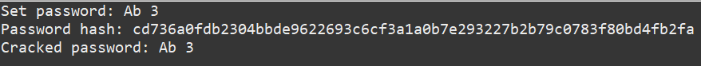

# Distributed-Systems
This repo contains all my implementation for the course Distributed Systems  

## Distributed Systems 3.1

Created a Client-Server distributed system, where they both communicate with each other. The client sends the hash of a password to the server, and the server cracks it using brute force and sends it back to the client.

